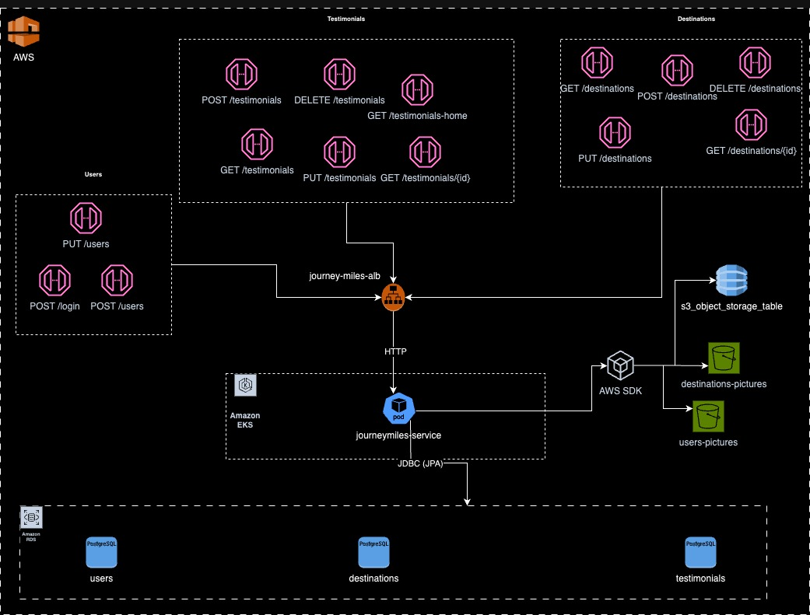
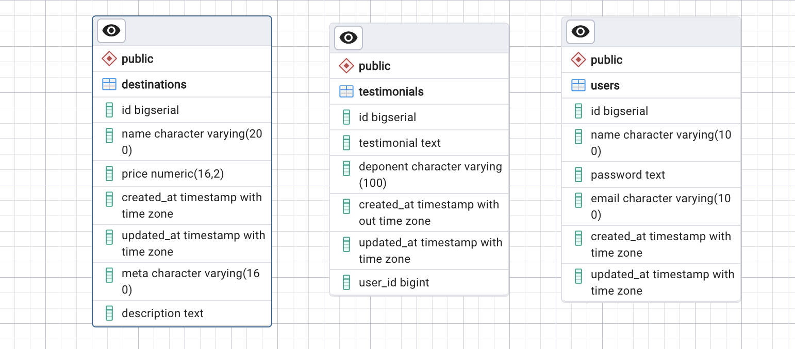

### SAD (Solution Architecture Document)

#### 1. Information's

##### 1.1 Description

The purpose of this project is to design a system to view and read more details about travel destinations.
It is based on Alura`s Backend Challenge 7Th Edition, so the business requirements and more details for this project can be found in the link bellow.

[Alura Backend Challenge 7th Edition](https://www.alura.com.br/challenges/back-end-7)

##### 1.2 Problems that the project solves

The main purpose for this project is to allow users to view travel destination and read details about them, also allowing them to leave testimonials about theis experiences.

#### 2. Requirements/Scope

To address these requirements the project has four domains with distinct functionalities:

###### 1 - Users Domain

- Allow a user to register or change their registration in the system
- Allow registered users to log in/out of the system

###### 2 - Testimonials Domain

- Users logged into the system may create/update testimonials
- All users can read testimonials
- A testimonial may display the profile picture of the deponent user

###### 3 - Destinations Domain

- Destinations can be created/updated/deleted in the system
- Every user may be able to search destinations based on a search criteria and view the results
- The details about the destinations can be viewed by any user based on its identifier
- To perform crud operations on a destination, there will be a security token that is mandatory in every call

###### 4 - Pictures Domain

- Pictures for destinations or users can be uploaded using separate endpoints
- Every picture will be stored in a specific S3 bucket
- The paths for these images will be stored in a DynamoDB table

#### 3. Architecture

###### 3.1 HLD (High Level Design)

###### 3.2 Relational Database EER diagram

###### 3.3 Relational Database Fields Description

| Table        | Field       | Type      | Description                                      |
|--------------|-------------|-----------|--------------------------------------------------|
| destinations | id          | Bigserial | Table's primary key                              |
| destinations | name        | Varchar   | The name for the Destination                     |
| destinations | price       | Decimal   | The price of the Destination                     |
| destinations | created_at  | Timestamp | Date and time the item was inserted in dastabase |
| destinations | updated_at  | Timestamp | Date and time the record was updated             |
| destinations | meta        | Text      | Metadata                                         |
| destinations | description | Text      | Description for the destination                  |
| testimonials | id          | Bigserial | Table's primary key                              |
| testimonials | testimonial | Text      | Users testimonials                               |
| testimonials | deponent    | Varchar   | The name of the deponent                         |
| testimonials | created_at  | Timestamp | Date and time the item was inserted in dastabase |
| testimonials | updated_at  | Timestamp | Date and time the record was updated             |
| testimonials | user_id     | Bigint    | Id of the user that wrote the testimonial        |
| users        | id          | Bigserial | Table's primary key                              |
| users        | name        | Varchar   | User's name                                      |
| users        | password    | Text      | User password                                    |
| users        | email       | Varchar   | User email, used to log in                       |
| users        | created_at  | Timestamp | Date and time the item was inserted in dastabase |
| users        | updated_at  | Timestamp | Date and time the record was updated             |

###### 3.4 NoSQL Schema

DynamoDB table name: s3_object_storage_table

| Column | Type | Key   | Description                                                   |
|--------|------|-------|---------------------------------------------------------------|
| id     | N    | Hash  | Unique Identifier,  relates to user or destination object |
| type   | S    | Range | Object type, used to identify user ou destination             |
| files  | L    | X     | List of paths to the objects stored in S3                     |

#### 4. References